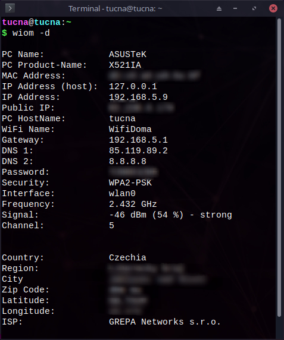
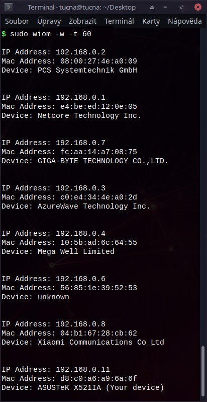

<h1 align="center">Who is on my WiFi</h1>

<p align="center">
 


 
</p>

<a href="images/logo/logo.png"></a>Who-is-on-my-wifi is a Python3 cli project that allows you to see who is stealing your WiFI network, scan your WiFI and show you how many devices are connected. Software can be installed on any Windows and Linux device (Mac not verified).

<h2></h2>

<h2>Table of contents</h2>

* <a href="#install">INSTALLATION</a><br/>
  * <a href = "#pip">Pip</a><br/>
  * <a href = "#deb">Debian based</a><br/>
  * <a href = "#tar">Tarball/ Source</a><br/>
* <a href = "#usage">USAGE</a><br/>
  * <a href="#module">Command</a><br/>
    * <a href = "#basicC">Basics</a><br/>
    * <a href = "#whoC">How to see who is on my wifi?</a><br/>
    * <a href = "#infoC">How to get information about my device?</a><br/>
  * <a href="#python">Python3</a><br/>
    * <a href = "#basicP">Basics</a><br/>
    * <a href = "#whoP">How to see who is on my wifi?</a><br/>
    * <a href = "#infoP">How to get information about my device?</a><br/>
  * <a href = "#error">Error</a><br/>
    * <a href = "#winpcap">WinPcapError:</a><br/>
    * <a href = "#route">route: not found:</a><br/>
* <a href = "#screen">SCREENSHOTS</a><br/>
* <a href = "#todo">TO-DO LIST</a><br/>
* <a href = "#license">LICENSE</a><br/>
  <br/>

<h2 id="install">INSTALLATION</h2>


Windows need <a href="https://www.winpcap.org/install/">WinPcap</a>.<br/>

<h3 id="pip">Pip</h3>

`pip3 install who-is-on-my-wifi` <br/>

<h3 id="debian">Debian based</h3>

Download the latest debian [package](https://github.com/tucnakomet1/Python-Who-Is-On-My-WiFi/releases) and then run the code: <br/>

```bash
sudo dpkg -i Python-Who-Is-On-My-WiFi*.deb
```
Or download the latest deb for example from [release page](https://github.com/tucnakomet1/Python-Who-Is-On-My-WiFi/releases) and follow these commands.

```bash
### Download commands ###
wget https://github.com/tucnakomet1/Python-Who-Is-On-My-WiFi/releases/download/1.3.4/who-is-on-my-wifi-v1.3.4.deb

### Install ###
sudo dpkg -i who-is-on-my-wifi-v1.3.4.deb
rm who-is-on-my-wifi-v1.3.4.deb #remove useless package

### Uninstall ###
sudo dpkg -r who-is-on-my-wifi-v1.3.4
```

<br/>


<h3 id="tar">Tarball/ Source</h3>

Download the latest tar [release](https://github.com/tucnakomet1/Python-Who-Is-On-My-WiFi/releases). Use any file manager or run command to extract package:

```bash
### Tarball ###
tar -xvzf Python-Who-Is-On-My-WiFi*.tar.gz

### Zip ###
unzip Python-Who-Is-On-My-WiFi*.zip

### Git ###
git clone https://github.com/tucnakomet1/Python-Who-Is-On-My-WiFi.git

### Install ###
cd Python-Who-Is-On-My-WiFi*
sudo chmod +x install
./install
```

<h2 id="usage">USAGE</h2>

<h3 id="module"> Command </h3>

<h4 id="basicC"> Basics </h4>

```
usage: wiom [-h] [-v] [-c] [-d] [-w] [-t]

Who-Is-On-My-WIFi

optional arguments:
  -h, --help     show this help message and exit
  -v, --version  show current version
  -l, --license  show Open Source License
  -c, --contact  show contact
  -d, --device   show information about your device
  -w, --who      show who is on your WiFi!
  -t , --time    int supplement for '-w' command (scanning '-t' seconds)

GitHub: <https://github.com/tucnakomet1>
```

<br/>

<h4 id="whoC"> How to see who is on my wifi? </h4>

!!! You have to run this command as `sudo` or as `Administrator` !!!

```shell
linux@name:~$ sudo wiom -w 			# default scanning time is 10 sec
linux@name:~$ sudo wiom -w -t 5 	# scanning wifi for 5 sec
```

<br/>

<h4 id="infoC"> How to get information about my device? </h4>

```shell
linux@name:~$ sudo wiom -d
```

<br/>

<h3 id="python"> Python3 </h3>


<h4 id="basicP"> Basics </h4>

```python
>>> import who_is_on_my_wifi as wiom
>>>
>>> wiom.help()	# help page
>>> wiom.license()	# see license
>>> wiom.contact()	# contact page
>>>
>>> wiom.who(n)	# see who is on my wifi (int('n') is scanning time - optional; default is 10)
>>> wiom.device()	# information about wifi and your device

```

<h4 id="whoP"> How to see who is on my wifi? </h4>

!!! You have to run this script as `sudo` or as `Administrator` !!!

```python
from who_is_on_my_wifi import *

WHO = who() # who(n)
for j in range(0, len(WHO)):
	comm = f"\n{WHO[j][0]} {WHO[j][1]}\n{WHO[j][2]} {WHO[j][3]}\n{WHO[j][4]} {WHO[j][5]}\n"
	print(comm)

# >>> OUTPUT <<<

# IP Address: 192.168.0.1
# Mac Address: 38:43:7d:62:42:24
# Device: Compal Broadband Networks, Inc. (router)

# IP Address: 192.168.0.24
# Mac Address: 10:5b:ad:6c:64:55
# Device: Mega Well Limited

...

```
<br/>

<h4 id="infoP"> How to get information about my device? </h4>

```python
from who_is_on_my_wifi import *

dev = device()

print(f"""
PC Name:            {dev[0]}
PC Product-Name:    {dev[1]}
MAC Address:        {dev[2]}
IP Address (host):  {dev[3]}
IP Address:         {dev[4]}
Public IP:          {dev[5]}
PC HostName:        {dev[6]}
WiFi Name:          {dev[7]}
Gateway:            {dev[8]}
DNS 1:              {dev[9]}
DNS 2:              {dev[10]}
Password:           {dev[11]}
Security:           {dev[12]}
Interface:          {dev[13]}
Frequency:          {dev[14]}
Signal:             {dev[15]}
Channel:            {dev[16]}


Country:            {dev[17]}
Region:             {dev[18]}
City:               {dev[19]}
Zip Code:           {dev[20]}
Latitude:           {dev[21]}
Longitude:          {dev[22]}
Map:                {dev[23]}
ISP:                {dev[24]}
""")
```

<br/>

<h3 id = "error"> Error </h3>


<h4 id = "winpcap">RuntimeError: Sniffing and sending packets is not available at layer 2: winpcap is not installed </h4>

This error means that you don't have ***WinPcap*** installed. <br/>
To fix this you have to [download](https://www.winpcap.org/install/) it from their web page.
<br/>

<h4 id = "route">/bash/sh: 1: route: not found... </h4>

This error means that you don't have ***net-tools*** installed. <br/>
To fix this you have to download it using `sudo apt-get install net-tools`

<br/>


<h2 id="screen">SCREENSHOTS</h2>
| `wiom -d`                                    | `wiom -w`                              |
| -------------------------------------------- | -------------------------------------- |
|  |  |

<br/>


<h3 id = "error"> Error </h3>

<h4 id = "winpcap">RuntimeError: Sniffing and sending packets is not available at layer 2: winpcap is not installed </h4>
This error means that you don't have ***WinPcap*** installed. <br/>
To fix this you have to [download](https://www.winpcap.org/install/) it from their web page.
<br/>

<h4 id = "route">/bash/sh: 1: route: not found... </h4>

This error means that you don't have ***net-tools*** installed. <br/>
To fix this you have to download it using `sudo apt-get install net-tools`
<br/>

<h2 id="todo"> TO-DO LIST </h2>

- [ ] Validated MacOS support
- [ ] Add GUI
- [ ] Add list of verified devices
- [ ] Add WiFi Kill option
<br/>

<h2 id = "license"> LICENSE </h2>

[MIT](https://github.com/tucnakomet1/Python-Who-Is-On-My-WiFi/blob/master/LICENSE.txt)

```txt
MIT License

Copyright (c) 2020 Tucna

Permission is hereby granted, free of charge, to any person obtaining a copy
of this software and associated documentation files (the "Software"), to deal
in the Software without restriction, including without limitation the rights
to use, copy, modify, merge, publish, distribute, sublicense, and/or sell
copies of the Software, and to permit persons to whom the Software is
furnished to do so, subject to the following conditions:

The above copyright notice and this permission notice shall be included in all
copies or substantial portions of the Software.

THE SOFTWARE IS PROVIDED "AS IS", WITHOUT WARRANTY OF ANY KIND, EXPRESS OR
IMPLIED, INCLUDING BUT NOT LIMITED TO THE WARRANTIES OF MERCHANTABILITY,
FITNESS FOR A PARTICULAR PURPOSE AND NONINFRINGEMENT. IN NO EVENT SHALL THE
AUTHORS OR COPYRIGHT HOLDERS BE LIABLE FOR ANY CLAIM, DAMAGES OR OTHER
LIABILITY, WHETHER IN AN ACTION OF CONTRACT, TORT OR OTHERWISE, ARISING FROM,
OUT OF OR IN CONNECTION WITH THE SOFTWARE OR THE USE OR OTHER DEALINGS IN THE
SOFTWARE.
```
